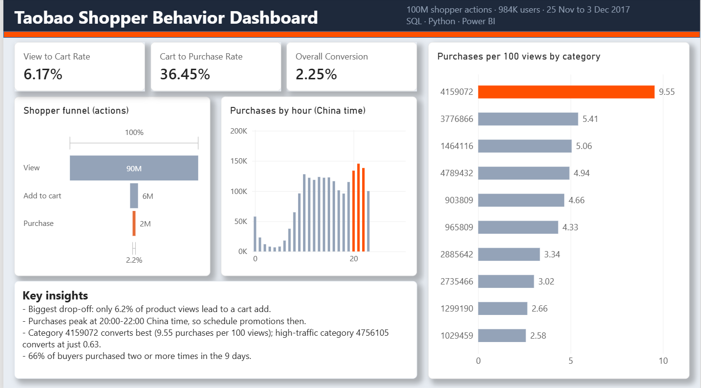
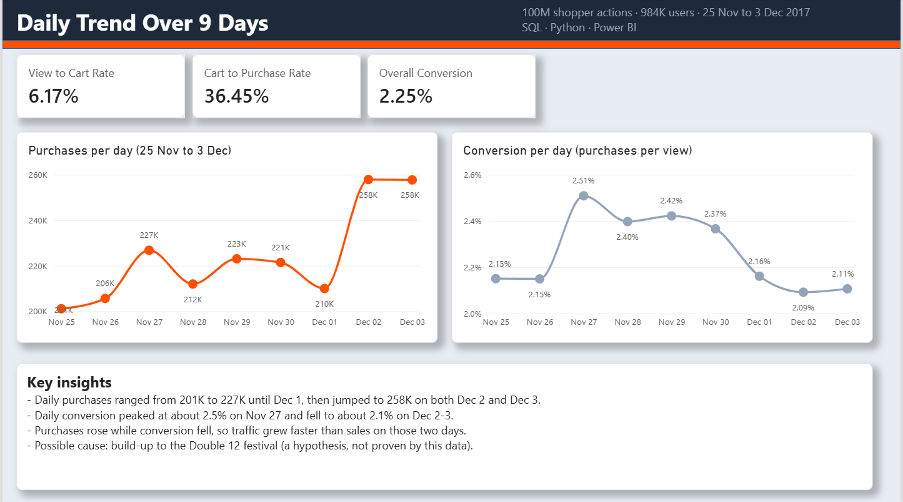
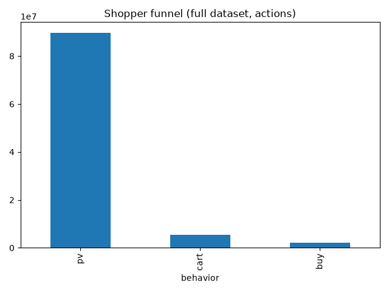
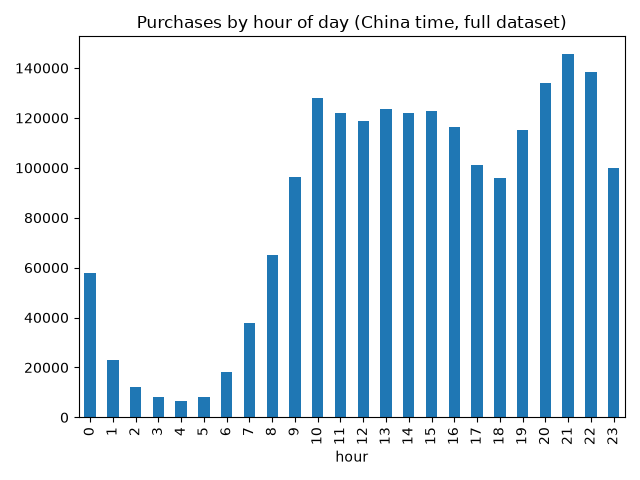
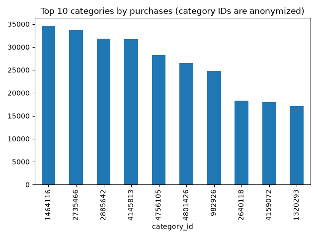

# Taobao Shopper Behavior Analysis (SQL + Python)

## Dashboard (Power BI)

## Project Question
Where do Taobao shoppers drop off between viewing a product and buying it, and what do buyers do differently?

## Data
Taobao User Behavior dataset (Kaggle / Alibaba Tianchi): about 100 million actions from roughly 1 million users, 25 Nov to 3 Dec 2017. Columns: user_id, item_id, category_id, behavior (pv = product page view, cart, fav, buy), timestamp.

**Cleaning:** 55,576 of 100,150,807 rows (0.06%) had timestamps outside the documented 25 Nov to 3 Dec window and were removed.

## Tools
SQL (DuckDB), Python (pandas, matplotlib)

## Findings

### 1. The biggest drop-off is between viewing and adding to cart
Of 89.7M product views, only 6.2% led to a cart add. Once an item was in the cart, 36.4% were bought. Overall, about 2.2 purchases happened per 100 views.

An earlier analysis of a 2M-row sample (analysis.py) gave the same funnel, so the sample was representative for these metrics.

### 2. Most users do buy, but only after browsing a lot
Counting unique users: 984,105 viewed products, 738,996 (75.1%) added to cart and 672,404 (68.3%) bought. Shoppers look at many products and buy a few.

### 3. Purchases peak in the evening
Purchases are highest between 20:00 and 22:00 China time (about 134,000 to 145,000 purchases per hour) and dip around 18:00 (about 96,000).

### 4. Categories differ a lot in how well views turn into purchases
Among the top 10 categories by purchases (each with 100k+ views), conversion ranges from 0.63 to 9.55 purchases per 100 views. Category 4159072 converts best (9.55) but gets only about 189k views. Category 4756105 gets about 4.5M views and converts at just 0.63. Category IDs are anonymized, so products cannot be named.

### 5. Two thirds of buyers come back
443,858 of 672,404 buyers (66.0%) bought two or more times in the 9 days.

## Recommendations
1. **Test improvements to the product page and view-to-cart step first.** It is the largest drop in the funnel, so small gains there matter most.
2. **Schedule promotions for 20:00 to 22:00**, when purchase activity is highest.
3. **Review high-view, low-conversion categories** (for example 4756105 and 982926) and **give more exposure to categories that convert well but get few views** (for example 4159072).
4. **Invest in retention.** Most buyers purchase more than once, so repeat-purchase programs are worth testing.

These are hypotheses suggested by the data; testing them would need experiments (A/B tests).

## Limitations
- Only 9 days of data, from one platform.
- The users are active shoppers, so the high rates of buying and repeat buying are not typical of a general store.
- No price, product name, or demographic data (category IDs are anonymized).
- The analysis describes behavior; it cannot show what causes it.

## How to run
1. Download UserBehavior.csv from Kaggle ("User Behavior Data from Taobao for Recommendation") and put it in the same folder as the scripts.
2. Install the libraries: `pip install duckdb pandas matplotlib`
3. Run the full analysis (about 1 minute): `python full_analysis.py`

`analysis.py` is the earlier version that works on a 2M-row sample.
